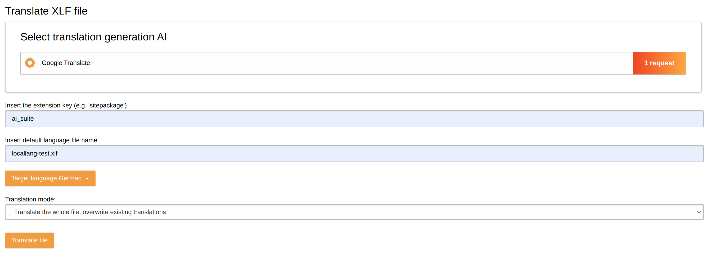
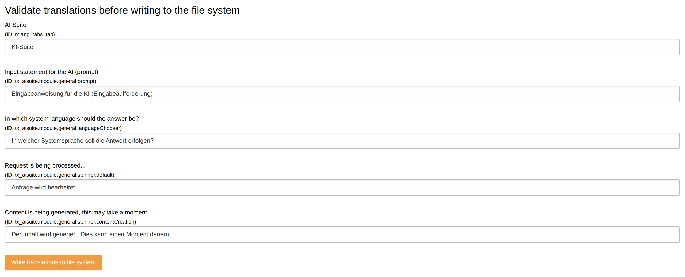

.. include:: ../Includes.txt

.. _content_element_generation:

Translation of XLIFF files
==========================

Target group: **Administrators**

.. _translate_xliff_files:

Translate XLIFF files with AI
^^^^^^^^^^^^^^^^^^^^^^^^^^^^^^^^^

The AI Suite backend module comes with the possibility to translate XLIFF files with the help of the AI. You can find the translation of XLIFF files under the main point "Agency".

In the next step you can make the following settings:

- Translate generation AI library
- File extension key
- Default language file name
- Target language
- Translation mode ("Translate the whole file, overwrite existing translations" or "Translate only missing items")

If you click on the "Translate file" button, the AI will translate all (or the missing) items of the source language file for you.

After the translation has been completed, you can validate all selected results again and finally save the XLIFF file in the target language.

