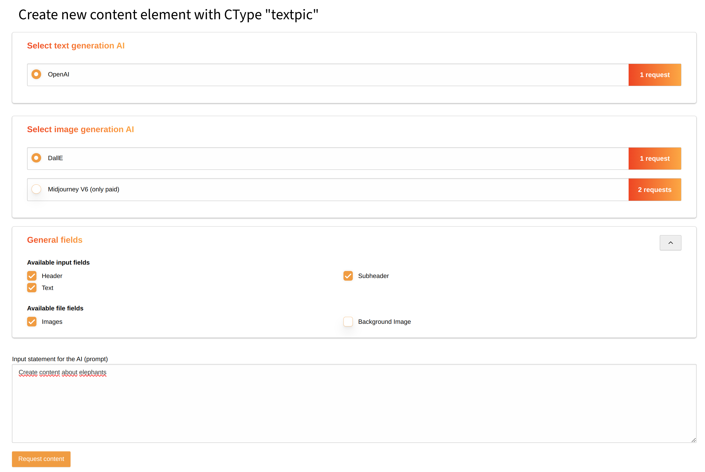
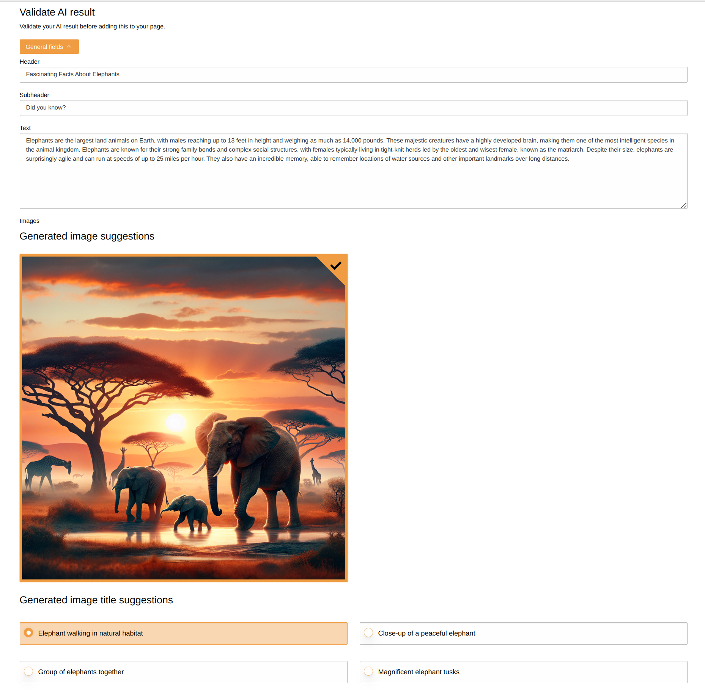

.. include:: ../Includes.txt

.. _content_element_generation:

Content element generation
==========================

Target group: **Editors**

.. _generate_content_elements_with_ai:

Generate content elements with AI
^^^^^^^^^^^^^^^^^^^^^^^^^^^^^^^^^

The AI Suite extension comes with the possibility to generate content elements with the help of the AI.

As with normal content elements, you can also create all available content elements from certain categories via AI by going to the New Content Element Wizard and selecting the corresponding element in the "AI Suite Content" section.

.. figure:: ai-content-elements-selection.png

In the next step you can make the following settings based on the selected element:

- Text generation and/or image generation AI library
- Fields of the content element that should be generated by the AI
- Input statement for the AI (prompt)

If you click on the "Request content" button, the AI will generate all necessary inputs of the content element for you.

After the content generation has been completed, you can validate all selected results again and finally save the content element

