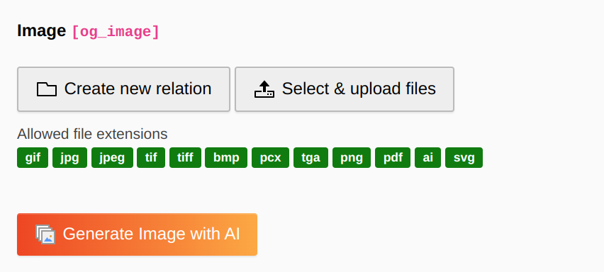
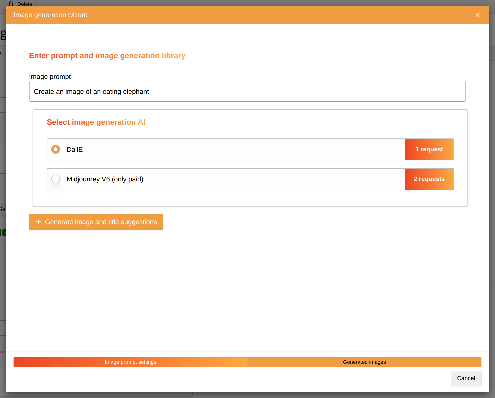
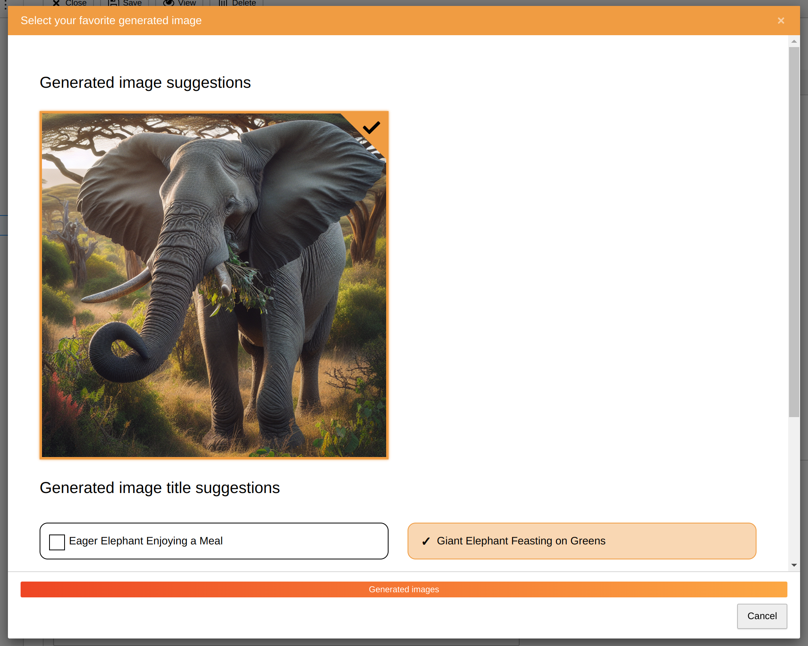

.. include:: ../Includes.txt

.. _image_generation_through_wizard:

Image generation through wizard
===============================

Target group: **Editors**

.. _generate_content_elements_with_ai:

Generate images with AI in your page or content elements
^^^^^^^^^^^^^^^^^^^^^^^^^^^^^^^^^^^^^^^^^^^^^^^^^^^^^^^^

The AI Suite comes with the possibility to generate images directly in your page or content elements. You will find a new button called "Generate Image with AI" next to the default buttons.

After clicking on the button, a multi-step wizard for image generation opens.

.. _prompt_and_library_for_image_generation:

Prompt and library for image generation
---------------------------

On the first page you have to specify your prompt (minimum of 5 characters) and the AI library for the image generation.

When you click on the "Generate image and title suggestions" button, the AI will generate the images and possible image titles for you. This can take a few seconds. You will see a loading animation in the meantime.

Image and image title suggestions
---------------------------------

On the second page you see the generated image and image title suggestions. You can select one image and one corresponding title or regenerate the suggestions. The selection will then be added to the content element input field.

