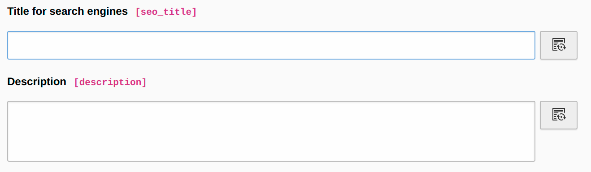
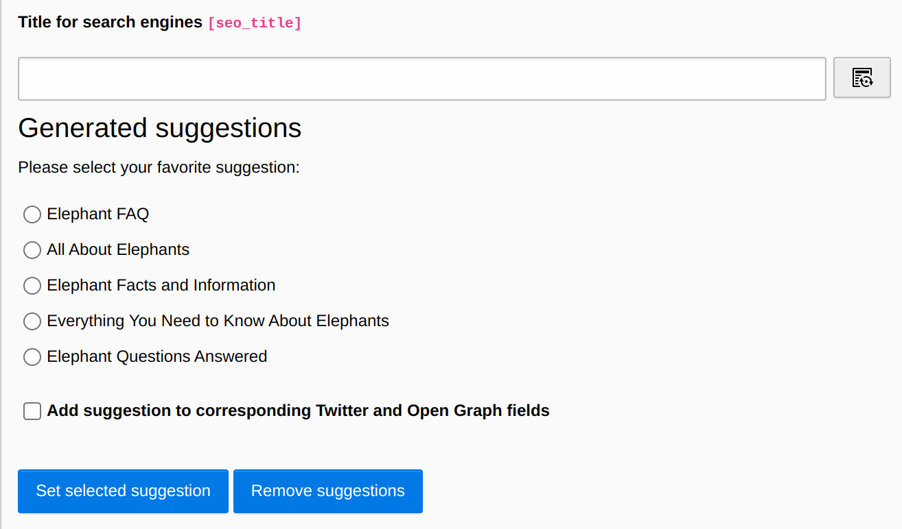

.. include:: ../Includes.txt

.. _metadata_generation:

Metadata generation
===================

Target group: **Editors**

.. _generate_data_for_page_properties:

Generate data for page properties
^^^^^^^^^^^^^^^^^^^^^^^^^^^^^^^^^

If you want to generate metadata for several fields you can use the field control buttons which are added next to the corresponding input fields.

After generation is complete, you will receive suggestions that are structured as follows:

The following metadata can be generated:

.. _generate_meta_description_suggestions:

Generate meta description (suggestions)
---------------------------------------

There is an additional button next to the meta description text field. When you click this button, the (text) content of the selected page is generated, and you get meta description suggestions with the help of the AI. By default, the extension prepares the meta description suggestions in such a way that they can be selected via radio button.

It can happen that the AI returns texts that exceed the maximum allowed length of the meta description. To additionally check the length of the meta description, the extension `Yoast SEO for TYPO3 <https://extensions.typo3.org/extension/yoast_seo>`_ can be used, for example, or various online tools.

.. _generate_keywords_suggestions:

Generate keywords (suggestions)
-------------------------------

There is an additional button next to the keywords text field. When you click this button, the (text) content of the current page is viewed and with this infos the keywords suggestions are generated as close as possible with the help of the AI. Currently, the page must not be deactivated in the backend. Depending on the page size, the process may take a few seconds. However, notifications are used to display appropriate information. Please note that an empty page might bring up confusing results. You should have at least a few sentences on the page to get meaningful results.

.. _generate_page_title_suggestions:

Generate page title (suggestions)
---------------------------------

There is an additional button next to the seo title text field. When you click this button, the (text) content of the current page is viewed and you get page title suggestions with the help of the AI. By default, the extension prepares the page title suggestions in such a way that they can be selected via radio button. Please note that an empty page might bring up confusing results. You should have at least a few sentences on the page to get meaningful results.

.. figure:: generate-page-title-suggestions.png

.. _generate_open_graph_title_suggestions:

Generate Open Graph title (suggestions)
---------------------------------------

There is an additional button next to the Open Graph title text field. When you click this button, the (text) content of the current page is viewed, and you get Open Graph title suggestions with the help of AI. By default, the extension prepares the Open Graph title suggestions in such a way that they can be selected via radio button. Please note that an empty page might bring up confusing results. You should have at least a few sentences on the page to get meaningful results.

.. _generate_open_graph_descriptions_suggestions:

Generate Open Graph description (suggestions)
---------------------------------------------

There is an additional button next to the Open Graph description text field. When you click this button, the (text) content of the current page is viewed, and you get Open Graph description suggestions with the help of AI. By default, the extension prepares the Open Graph description suggestions in such a way that they can be selected via radio button.  Please note that an empty page might bring up confusing results. You should have at least a few sentences on the page to get meaningful results.

.. _generate_twitter_title_suggestions:

Generate Twitter title (suggestions)
------------------------------------

There is an additional button next to the Twitter title text field. When you click this button, the (text) content of the current page is viewed, and you get Twitter title suggestions with the help of AI. By default, the extension prepares the Twitter title suggestions in such a way that they can be selected via radio button. Please note that an empty page might bring up confusing results. You should have at least a few sentences on the page to get meaningful results.

.. _generate_twitter_description_suggestions:

Generate Twitter description (suggestions)
------------------------------------------

There is an additional button next to the Twitter description text field. When you click this button, the (text) content of the current page is viewed, and you get Twitter description suggestions with the help of AI. By default, the extension prepares the Twitter description suggestions in such a way that they can be selected via radio button. Please note that an empty page might bring up confusing results. You should have at least a few sentences on the page to get meaningful results.

.. _use_page_title_suggestions_for_open_graph_and_twitter_titles:

Use page title suggestion for Open Graph and Twitter titles
-----------------------------------------------------------

You have the option to copy the selected page title suggestion to the fields for Open Graph and Twitter titles (can be found within the tab "Social media"). Therefore you can enable the checkbox under the suggestions. If you select a page title the content will be copied to the fields `og_title` and `twitter_title` too.

.. _use_page_title_suggestions_for_open_graph_and_twitter_descriptions:

Use meta description suggestion for Open Graph and Twitter descriptions
-----------------------------------------------------------------------

You have the option to copy the selected meta description suggestion to the fields for Open Graph and Twitter descriptions (can be found within the tab "Social media"). Therefore you can enable the checkbox under the suggestions. If you select a meta description the content will be copied to the fields `og_description` and `twitter_description` too.

.. _generate_data_for_articles_of_ext_news:

Generate data for articles of EXT:news
^^^^^^^^^^^^^^^^^^^^^^^^^^^^^^^^^^^^^^

Currently, the following metadata can be generated:

.. _generate_news_meta_description_suggestions:

Like described above, the following metadata can be generated for news articles:

- Generate meta description (suggestions)
- Generate keywords
- Generate alternative title (suggestions)

Since there is the need to generate and view the content of the news article, your integrator must give a detail page uid to the extension configuration.

It can happen that the AI returns texts that exceed the maximum allowed length of the meta description. To additionally check the length of the meta description, the extension ["Yoast SEO for TYPO3"](https://extensions.typo3.org/extension/yoast_seo "Yoast SEO for TYPO3") can be used, for example, or various online tools.
