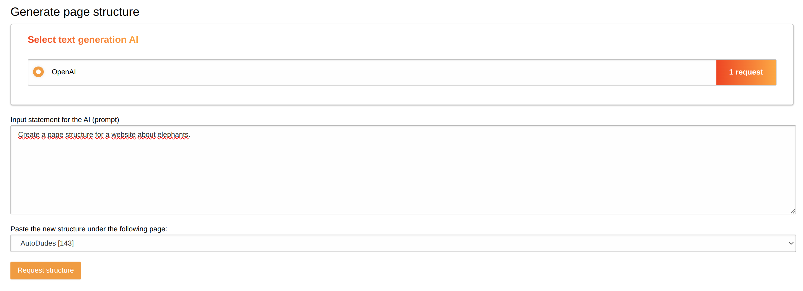

.. include:: ../Includes.txt

.. _page_structure_generation:

Page structure generation
=========================

Target group: **Editors**

.. _generate_page_structure_with_ai:

Generate page structure with AI
^^^^^^^^^^^^^^^^^^^^^^^^^^^^^^^

The AI Suite backend module comes with the possibility to generate whole page trees or sub page trees of existing pages with the help of AI. You can find the generation of page structure under the main point "Pages".

If you click on the "Create page tree" card, you will get to the following page, where you can enter these options:

- Input statement for the AI (prompt)
- Paste the new structure under the following page

If you click on the "Request structure" button, the AI will generate all necessary inputs of the page structure for you. If everything works and you get a valid result, the output will look like this:

.. figure:: generated-page-structure-results.png

You can edit every single page title, move the pages around, add new pages and delete pages. Also you can hide or show the control options.

If you are satisfied with the result, you can click on the "Create structure" button and the page tree will be created. If you want to regenerate the page structure with a modified prompt, you can do this as well.

Since this is a very specific task, it could be that the AI can not generate the page structure as you want it to be. If there is no valid result (no pages generated), we try to detect this and the request will not get charged. So you may need in some cases some more tries with different prompts to get the result you want.
